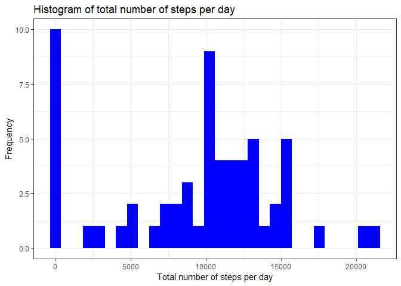
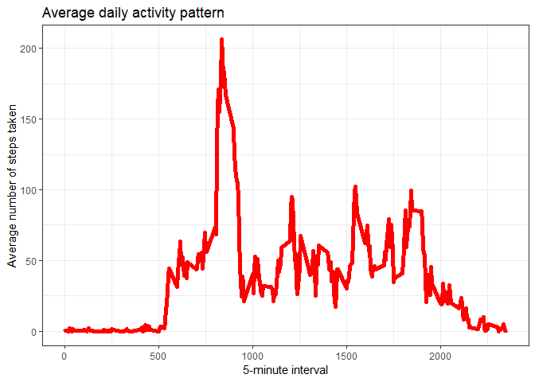
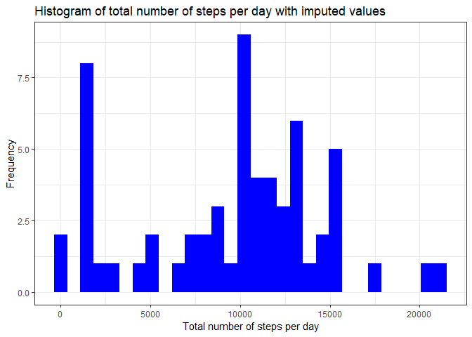
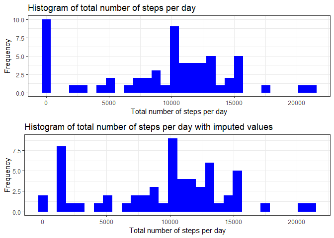
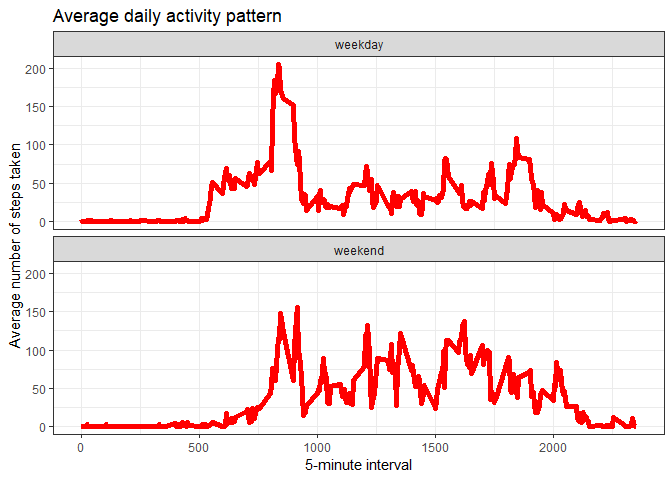

## Introduction  
Project for week 2 of the Reproducible Research course on Coursera. 

## Clean environment  
Cleaning the workspace.  

```r
rm(list = ls())
objects()
search()
intersect(objects(), search())
```

## Libraries  
Libraries used to perform the analysis.  

```r
library(tidyverse)
library(lubridate)
library(knitr)
library(gridExtra)
```


## Loading and preprocessing the data
The dataset is available in a zip file called activity.zip.  
The file is unzipped and loaded then the "date" variable is converted into a 
data format.

```r
# Extracting file in the working directory
unzip(zipfile = "activity.zip", junkpaths = TRUE)
# Load the data into R
activity <-
        read.csv(
                file = "activity.csv",
                header = TRUE,
                na.strings = "NA",
                stringsAsFactors = FALSE
        )
# Converting the variable "date" into a date format
activity$date <- ymd(activity$date) 
```


## What is mean total number of steps taken per day?

### Histogram of the total number of steps taken each day  


```r
# Obtaining the total number of steps per day
stepsDay <- activity %>% 
        group_by(date) %>%
        summarise(stepsDay = sum(steps, na.rm = TRUE))

kable(head(stepsDay))
```


date          stepsDay
-----------  ---------
2012-10-01           0
2012-10-02         126
2012-10-03       11352
2012-10-04       12116
2012-10-05       13294
2012-10-06       15420

```r
kable(tail(stepsDay))
```


date          stepsDay
-----------  ---------
2012-11-25       11834
2012-11-26       11162
2012-11-27       13646
2012-11-28       10183
2012-11-29        7047
2012-11-30           0

```r
# Generating histogram
ggplot(data = stepsDay, mapping = aes(x = stepsDay)) +
        geom_histogram(fill = "blue") +
        labs(title = "Histogram of total number of steps per day") +
        labs(x = "Total number of steps per day", y = "Frequency") +
        theme_bw()
```

<!-- -->

### Calculate and report the **mean** and **median** total number of steps taken each day


```r
mean_steps <- mean(stepsDay$stepsDay) %>%
        round(digits = 0)
median_steps <- median(stepsDay$stepsDay) %>%
        round(digits = 0)
```

The mean number of steps taken each day is **9354**.  
The median number of steps taken each day is 
**10395** .    

## What is the average daily activity pattern?

### Time series plot of the 5-minute interval and average number of steps taken


```r
# Obtaining average number of steps per 5-minutes interval
time_series <- activity %>%
        group_by(interval) %>%
        summarise(stepsAVG = mean(steps, na.rm = TRUE))

kable(head(time_series))
```


 interval    stepsAVG
---------  ----------
        0   1.7169811
        5   0.3396226
       10   0.1320755
       15   0.1509434
       20   0.0754717
       25   2.0943396

```r
kable(tail(time_series))
```


 interval    stepsAVG
---------  ----------
     2330   2.6037736
     2335   4.6981132
     2340   3.3018868
     2345   0.6415094
     2350   0.2264151
     2355   1.0754717

```r
# Generating time series plot
ggplot(data = time_series, mapping = aes(x = interval, y = stepsAVG)) +
        geom_line(color = "red", size = 2) +
        labs(title = "Average daily activity pattern") +
        labs(x = "5-minute interval", y = "Average number of steps taken") +
        theme_bw()
```

<!-- -->


### Which 5-minute interval, on average across all the days in the dataset, contains the maximum number of steps?


```r
interval_max_steps <- time_series$interval[which.max(time_series$stepsAVG)]
max_steps <- max(time_series$stepsAVG)
```

The 5-minute interval that on average contains the maximum number of steps across 
all the days is **835**.  
During that interval on average **206** are taken.  

## Imputing missing values

### Calculate and report the total number of missing values


```r
# Obtaining the number of missing values by variable
apply(X = is.na(activity), MARGIN = 2, FUN = sum)
```

```
##    steps     date interval 
##     2304        0        0
```

We have missing values only for the "steps" variable, so the total number of rows 
with NA in the dataset is equal to the total number of missing values in the "steps" 
variable i.e. **2304**.  

### Devise a strategy for filling in all of the missing values in the dataset.  


```r
tot_n_intervals <- length(unique(activity$interval))
```

In total there are **288** 5-minute intervals per each day.  
However, it appears that the missing values are concentyrate in 8 specific days 
for which no data is available (see below).  


```r
missing_days <- tapply(X = is.na(activity$steps), INDEX = activity$date, FUN = sum)
missing_days
```

```
## 2012-10-01 2012-10-02 2012-10-03 2012-10-04 2012-10-05 2012-10-06 
##        288          0          0          0          0          0 
## 2012-10-07 2012-10-08 2012-10-09 2012-10-10 2012-10-11 2012-10-12 
##          0        288          0          0          0          0 
## 2012-10-13 2012-10-14 2012-10-15 2012-10-16 2012-10-17 2012-10-18 
##          0          0          0          0          0          0 
## 2012-10-19 2012-10-20 2012-10-21 2012-10-22 2012-10-23 2012-10-24 
##          0          0          0          0          0          0 
## 2012-10-25 2012-10-26 2012-10-27 2012-10-28 2012-10-29 2012-10-30 
##          0          0          0          0          0          0 
## 2012-10-31 2012-11-01 2012-11-02 2012-11-03 2012-11-04 2012-11-05 
##          0        288          0          0        288          0 
## 2012-11-06 2012-11-07 2012-11-08 2012-11-09 2012-11-10 2012-11-11 
##          0          0          0        288        288          0 
## 2012-11-12 2012-11-13 2012-11-14 2012-11-15 2012-11-16 2012-11-17 
##          0          0        288          0          0          0 
## 2012-11-18 2012-11-19 2012-11-20 2012-11-21 2012-11-22 2012-11-23 
##          0          0          0          0          0          0 
## 2012-11-24 2012-11-25 2012-11-26 2012-11-27 2012-11-28 2012-11-29 
##          0          0          0          0          0          0 
## 2012-11-30 
##        288
```

```r
table(missing_days)
```

```
## missing_days
##   0 288 
##  53   8
```
 
As a consequence it would not make sense to use as imput value the mean, median, etc... 
per day.
My strategy is to use as imput value the median value per 5-minute interval.  
I prefer using the median rather than the mean since it is less sensitive to extreme 
values.  

### Create a new dataset that is equal to the original dataset but with the missing data filled in  


```r
# Creating a copy of the original dataset
activity_no_miss <- activity

# Filling in the missing values
for (i in 1:nrow(activity_no_miss)) {
        if (is.na(activity_no_miss$steps[i])) {
                activity_no_miss$steps[i] <-
                        round(median(activity_no_miss$steps[activity_no_miss$interval == activity_no_miss$interval[i]], na.rm = TRUE),
                              digits = 0)
        }
        
}
```

### Make a histogram of the total number of steps taken each day and Calculate and report the mean and median total number of steps taken per day.  


```r
# Obtaining the total number of steps per day
stepsDay_no_missing <- activity_no_miss %>% 
        group_by(date) %>%
        summarise(stepsDay = sum(steps, na.rm = TRUE))

kable(head(stepsDay_no_missing))
```


date          stepsDay
-----------  ---------
2012-10-01        1141
2012-10-02         126
2012-10-03       11352
2012-10-04       12116
2012-10-05       13294
2012-10-06       15420

```r
kable(tail(stepsDay_no_missing))
```


date          stepsDay
-----------  ---------
2012-11-25       11834
2012-11-26       11162
2012-11-27       13646
2012-11-28       10183
2012-11-29        7047
2012-11-30        1141

```r
# Generating histogram
ggplot(data = stepsDay_no_missing, mapping = aes(x = stepsDay)) +
        geom_histogram(fill = "blue") +
        labs(title = "Histogram of total number of steps per day with imputed values") +
        labs(x = "Total number of steps per day", y = "Frequency") +
        theme_bw()
```

<!-- -->

```r
# Mean number of steps according to dataset whit imputed data
mean_steps_no_miss <- mean(stepsDay_no_missing$stepsDay) %>%
        round(digits = 0)
# Median number of steps according to dataset whit imputed data
median_steps_no_miss <- median(stepsDay_no_missing$stepsDay) %>%
        round(digits = 0)
```

The mean number of steps taken is **9504**.  
There is an increase in respect to the mean number of steps taken according to 
the dataset with missing values, which is **9354**.  
That is due to the fact that by removing the missing values in the original 
dataset it was considered that the number of steps taken in the days in which no 
data were recorder was 0. Thus that was pushing down the mean.  
The median number of steps taken is 
**10395**.  
There is no change in respect to the median number of steps taken according to 
the dataset with missing values since we imputed the median value for each 
5-minute interval.  
Thus, imputing missing data has shifted the total daily number of steps towards 
higher values.  
This pattern can be seen in the graph here below were the histograms of the total 
number of steps taken each day are compared.

```r
# Histogram using original dataset with missing data
hist_missing <-
        ggplot(data = stepsDay, mapping = aes(x = stepsDay)) +
        geom_histogram(fill = "blue") +
        labs(title = "Histogram of total number of steps per day") +
        labs(x = "Total number of steps per day", y = "Frequency") +
        theme_bw()

# Histogram using dataset in which missing data have been imputed
hist_no_missing <-
        ggplot(data = stepsDay_no_missing, mapping = aes(x = stepsDay)) +
        geom_histogram(fill = "blue") +
        labs(title = "Histogram of total number of steps per day with imputed values") +
        labs(x = "Total number of steps per day", y = "Frequency") +
        theme_bw()

# Graph comparig the two histograms
grid.arrange(hist_missing, hist_no_missing, nrow =2)
```

<!-- -->


## Are there differences in activity patterns between weekdays and weekends?

### Create  new factor variable in the dataset with two levels -- "weekday" and "weekend".


```r
# Obtaining the day of the week, I set the function in a way that the week 
# starts on Monday (week_start = 1).
activity_no_miss$day_type <- wday(x = activity_no_miss$date, week_start = 1)

# Converting day of the week into factor variable with "weekday" or "weekend"
for (i in 1:nrow(activity_no_miss)) {
        if(activity_no_miss$day_type[i]>5){
                activity_no_miss$day_type[i] <- "weekend"
        } else {
                activity_no_miss$day_type[i] <- "weekday"
        }
}

# Converting varaible from character into factor
activity_no_miss$day_type <- as.factor(activity_no_miss$day_type)
```

### Time series plot of the 5-minute interval and the average number of steps taken, averaged across all weekday days or weekend days.


```r
# Obtaining average number of steps per 5-minute interval per type of day
time_series_day_type <- activity_no_miss %>%
        group_by(day_type, interval) %>%
        summarise(stepsAVG = mean(steps, na.rm = TRUE))

kable(head(time_series_day_type))
```


day_type    interval    stepsAVG
---------  ---------  ----------
weekday            0   2.0222222
weekday            5   0.4000000
weekday           10   0.1555556
weekday           15   0.1777778
weekday           20   0.0888889
weekday           25   1.3111111

```r
kable(tail(time_series_day_type))
```


day_type    interval   stepsAVG
---------  ---------  ---------
weekend         2330     1.0625
weekend         2335    11.0000
weekend         2340     5.8750
weekend         2345     1.6250
weekend         2350     0.0000
weekend         2355     0.0000

```r
# Generating time series panel plot
ggplot(data = time_series_day_type, mapping = aes(x = interval, y = stepsAVG)) +
        geom_line(color = "red", size = 2) +
        labs(title = "Average daily activity pattern") +
        labs(x = "5-minute interval", y = "Average number of steps taken") +
        facet_wrap(facets = vars(day_type), nrow = 2) +
        theme_bw() 
```

<!-- -->

Looking at the graph it seems that the average number of steps per 5-minute 
intervals is a bit more spread along the day during the weekends when compared 
to the weekdays.  
